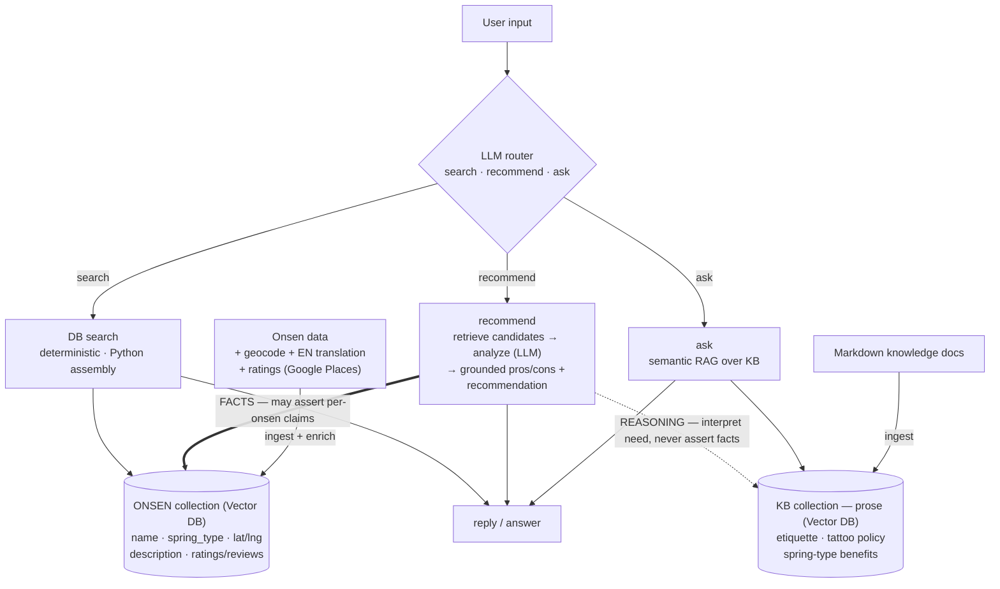

# Onsen Guide Bot — Project Journey

> **Find your perfect Japanese hot spring — in English.**
> An AI agent that helps English-speaking travellers discover Japanese onsen (hot springs) and nearby hotels, through a conversational chat + interactive map.

**Live:** Frontend → https://onsen-guide-bot.vercel.app · Backend API → https://onsen-guide-bot-production.up.railway.app (auth-gated)

---

## Why I built this

I wanted a project that was more than a toy LLM wrapper — something with a real data pipeline, a retrieval system, external API integrations, a production deployment, and the messy correctness problems that come with putting an LLM in front of users. Onsen are close to my heart, and the "English info is scarce" gap is real, so it doubled as something I'd actually use.

This is a portfolio piece, but it's not a throwaway demo — I intend to take it through V2 and V3. It doesn't have to be perfect; it has to keep getting better.

---

## V1 — What I built (shipped & live in production)

### Architecture
A clean, layered backend with strict boundaries, fronted by a React SPA:

```
React (Vite + Tailwind) ──HTTP──> FastAPI
                                     │
                              LangGraph ReAct agent (GPT-4o)
                                     │  tools (thin wrappers)
            ┌────────────────────────┼────────────────────────┐
     search_onsen            geocode_location          search_rakuten_onsen
            │                        │                          │
   retrieval_service        geocoding_service           rakuten_service
   (ChromaDB RAG)           (Google Maps)               (Rakuten Travel)
```

**Layering rules I enforced:** data flows downward only (`api → agent → tools → services`); `services/` stay framework-agnostic (no LangChain imports) so they're swappable; tools are thin wrappers with no business logic; `core/config.py` is the single source of truth for settings. One deliberate exception: the deterministic `POST /hotels` endpoint (a map click → coordinates-in/hotels-out lookup) calls the service directly, skipping the agent to avoid needless LLM latency and cost.

### Stack
- **Backend:** FastAPI, LangGraph ReAct agent, GPT-4o (chat) + `text-embedding-3-small` (embeddings), ChromaDB vector store.
- **Data:** a scraped/translated onsen dataset (~220 records across Okinawa + the Tokai region), Japanese → English translated at ingest via `gpt-4o-mini`, embedded into ChromaDB with prefecture/city/spring-type metadata.
- **Frontend:** React + Vite + Tailwind, a 3-panel layout (chat / Google Map / hotel list) driven by a `useReducer` state machine, `@react-google-maps/api`.
- **Integrations:** Google Maps (geocoding + JS map), Rakuten Travel API (real hotels near an onsen).
- **Infra:** Backend containerised on **Railway** (persistent volume for ChromaDB); frontend on **Vercel** (monorepo root = `frontend/`); GitHub Actions CI runs the backend test suite on PRs; Vercel Web Analytics.
- **Tests:** 76 backend (pytest, external I/O mocked) + 111 frontend (Vitest + React Testing Library), green.

### Features
- Conversational onsen search ("find me a sulfur onsen in Shizuoka") with location-aware retrieval.
- Results plotted on an interactive map; click a chat result to centre its marker.
- "See nearby hotels" → real Rakuten listings with prices, images, and booking links.
- English-first throughout, with original Japanese names preserved.

---

## Engineering challenges & how I solved them

This is the part I'm most proud of — most of these were *correctness* and *production* problems, not "make the LLM talk."

### 1. The LLM fabricated data it didn't have
**Problem:** When retrieval returned nothing (or the Rakuten tool returned no hotels), GPT-4o happily *invented* plausible-looking onsen and hotels from its training knowledge — e.g. asking for Shizuoka onsen returned famous real names (Atami, Shuzenji) that weren't in my dataset, with fabricated details and even placeholder `example.com` URLs.
**Solution:** Treated the LLM as untrusted for facts. Added explicit anti-fabrication guardrails in both the system prompt **and** the structured-output schema: every hotel and every onsen *must* come verbatim from the tool output; if a tool returned nothing, the list must be empty and the reply must say so. Map each field directly from tool output; leave missing fields null rather than inventing. This made the agent honest about "no results."

### 2. RAG semantic search ignored location
**Problem:** Pure vector similarity would happily return an Okinawa onsen for a "Tokyo" query — embeddings capture *vibe*, not *place*.
**Solution:** Added a ChromaDB metadata `where` filter on `prefecture_en`, and taught the agent to extract the prefecture from the user's message and pass it to the search tool. Semantic ranking *within* a hard location constraint.

### 3. App and ingest job wrote to different databases
**Problem:** In the Railway container, the app read an empty ChromaDB while the ingest job had written to a different (throwaway) path — so `/chat` returned zero results in prod despite "successful" ingestion. They computed the Chroma path independently.
**Solution:** Made `settings.chroma_path` (env-overridable) the single source of truth, and had the ingest job import the *same* `get_collection()` the app uses, so they can never diverge. Added regression tests that assert both resolve the same path/collection.

### 4. Brittle ingestion on real-world data
**Problem:** Real records had null `spa_quality` and empty descriptions — embedding an empty string is meaningless and can error at the embeddings API.
**Solution:** Document-building fallbacks (sales pitch → name+prefecture → constant) guaranteeing a non-empty embedding, plus graceful handling of missing fields.

### 5. Securing a public endpoint that spends money
**Problem:** Once deployed, `/chat` was publicly callable and every call triggers paid GPT-4o + embedding requests — an open door to cost abuse.
**Solution:** A static `X-API-Key` guard implemented as a reusable FastAPI dependency on `/chat` and `/hotels` (`/health` stays open for platform health checks). Constant-time comparison, and **fail-closed**: if the key is unset, every guarded request is rejected rather than silently allowing all. The frontend sends the key via a build-time env var through one centralised API helper.

### 6. Production deployment papercuts
- **CORS:** the deployed frontend was blocked until I added the exact Vercel origin to the backend's allowed origins (no trailing slash, exact match).
- **Vercel monorepo:** the project root has to point at `frontend/`, not the repo root.
- **Build-time env inlining:** `VITE_*` vars are baked into the JS bundle at build time and are publicly visible — fine for the Maps key (restricted by referrer) and the backend URL, but it shaped how I think about frontend "secrets."
- **Release flow:** prod auto-deploys from `main`, with `develop` as integration. Every change went `feature → PR → develop → release PR → main`; `main` was never touched directly.

### 7. Tests that were too rigid
**Problem:** Frontend tests asserted the `fetch` headers object *exactly*; the moment I added the `X-API-Key` header, they broke — even though the behaviour was correct.
**Solution:** Relaxed to `expect.objectContaining`, asserting the contract that matters rather than an exhaustive snapshot. A good reminder that over-specified tests punish correct change.

### 8. Performance: I fixed the "obvious" bottleneck — and measured that it wasn't one
**Problem:** The dataset has no coordinates, so the agent geocoded *every* returned onsen via a Google call at request time — up to ~20 per `/chat` after I raised the result cap to 20. The obvious latency culprit.
**Solution:** Geocode each onsen **once at ingest** and store `lat`/`lng` in ChromaDB metadata, then drop runtime geocoding. Shipped.
**The twist — I measured before *and* after.** Baseline ~22 s for a Shizuoka query; after removing runtime geocoding, ~22 s. No change. Reading the code explained why: the geocoding was already parallel (`asyncio.gather`), so it was never the dominant cost — the GPT-4o ReAct loop is (13–32 s, high variance). So the refactor was a real **cost + reliability** win (it stops re-paying Google to geocode the same static data on every request, and removes a runtime dependency) but **not** a latency win. The lesson: the "obvious" bottleneck was wrong, and only the measurement revealed it. The actual latency lever is the LLM loop — which points straight at the V2 workflow redesign.

### 9. I instrumented the loop and attributed the latency to the exact LLM calls
**Problem:** "The LLM loop is the bottleneck" was still a hand-wave. To justify the V2 workflow redesign I needed to know *which* calls cost what — instrument → baseline → (later) show the delta.
**Solution:** Wired LangSmith step-level tracing into the existing GPT-4o ReAct agent (off by default, fail-safe; enabled via `LANGSMITH_*` env vars surfaced through `core/config.py`). No agent refactor — just `stream_usage=True` for token capture and a named/tagged run config. Then I replayed `"find me 20 onsens in Shizuoka"` and read the per-step timeline straight off the request log.
**The attributed baseline (one 30 s run; the query returns 20 onsen):**

| Step | Graph node | Time |
|---|---|---:|
| LLM call #1 | agent node — decide to call `search_onsen(prefecture=Shizuoka)` | 1.2 s |
| embeddings + Chroma | tools node — retrieve 20 records | ~0.6 s |
| **LLM call #2** | agent node again — **"observe" the 20 records** (ReAct routing: am I done?) | **16.8 s** |
| **LLM call #3** | structured-output node — **re-serialize 20 records to JSON** (forced by `response_format=AgentResponse`) | **11.6 s** |

**Finding:** ~28 s of the 30 s is two GPT-4o round-trips that route the 20 retrieved records *through* the model — once to "observe" (#2), once to coerce into the response schema (#3). Both are configured on a single line: `create_react_agent(llm, tools, response_format=AgentResponse)`. Two distinct redundancies fall out: **#3 is redundant because the data is structured** (assemble `onsens[]` in Python), and **#2 is redundant because the control flow is predictable** for the dominant single-hop query (replace LLM routing with `if user_wants_hotels: …`). #2 isn't useless in principle — it's the tool-chaining router — so the workflow *replaces* it with explicit code rather than deleting the capability. This is the measured case for V2: collapse 3 round-trips → ~1, plausibly ~30 s → ~3–5 s, and remove the fabrication surface structurally. The high variance (16 s observed from Postman vs 30 s here) is itself an argument for fewer, smaller LLM calls.

### 10. I shipped the workflow redesign — and the predicted delta landed
**Problem:** Challenge #9 ended on a *prediction* (~30 s → ~3–5 s), not a result. The redesign had to be built, measured against the *same* query, and rolled out without a risky big-bang cutover.
**Solution:** Replaced the ReAct loop with a deterministic **workflow** for the dominant path, behind a `CHAT_ENGINE=react|workflow` env flag — same `/chat` contract, instant rollback, and a real A/B seam. The workflow keeps exactly **one** LLM call (`parse_intent`, on the cheaper `gpt-4o-mini`) to extract `{prefecture, query, wants_hotels}`, then assembles `onsens[]` in pure Python from Chroma metadata; hotels are a conditional code branch, not an LLM routing decision. Baseline calls #2 (observe) and #3 (JSON re-serialize) are gone.
**The measured A/B (same `"find me 20 onsens in Shizuoka"`; both return 20 grounded onsen):**

| Engine | LLM round-trips | Latency |
|---|---:|---:|
| ReAct (v1 baseline) | 3 | **35.3 s** |
| Workflow (v2) | 1 | **3.47–3.76 s** |

**Result:** ~**10× faster**, and #9's prediction held. The win isn't only speed: removing the LLM from the data-assembly path kills the fabrication surface *structurally* — the model can't invent onsen it never assembles. Shipped flag-gated, validated in prod via the A/B, then **cut over to `workflow` as the live engine** (ReAct retained behind the flag for rollback). The next LLM call to earn its place back is the `analyze_onsen` judgment layer — the one step where weighing trade-offs is genuinely a model's job.

---

## What I learned

- **LLMs are unreliable narrators.** The hard part of an AI product isn't generation — it's constraining it: grounding answers in retrieved data and making "I don't know" the default.
- **Retrieval needs structure, not just vectors.** Metadata filters + semantic ranking beat similarity alone.
- **Single source of truth or bust.** The Chroma path bug came from two code paths computing the "same" value independently.
- **Production is its own skill.** Auth, CORS, monorepo deploys, env handling, release discipline — none of it shows up in a local demo, all of it matters.
- **Measure before optimising — the obvious culprit is often wrong.** I was sure per-request geocoding was the latency bottleneck. Timing `/chat` before and after removing it showed no change; the LLM ReAct loop was the real cost. The number corrected the guess.
- **Use the least autonomy that solves the task.** I reached for an autonomous agent in V1; measuring and re-reading the flows showed they're fixed pipelines — a *workflow* with the LLM only where judgment is genuinely needed is cheaper, faster, and removes fabrication *structurally* (the LLM can't invent data it never assembles). The agent earns its keep at V3, not before.

---

## Honest limitations — and the path to production-grade

I'd rather name the gaps than pretend they don't exist. Here's what V1 deliberately doesn't do yet, and what it would take to make it production-/senior-grade. (The first three are also the top of my V2 plan — they're product improvements *and* the things that demonstrate real LLM-engineering rigor.)

**AI engineering depth**
- **Eval harness — seeded (fabrication slice).** I built a small fabrication eval (`scripts/eval_fabrication.py`): fixed cases with ground truth read from the DB — out-of-data prefectures must return *empty* (the no-fabrication contract), in-data ones must return only real onsen. It already earned its keep, catching that `gpt-4o-mini` isn't a safe drop-in (it misuses the search tool). Still to broaden: retrieval hit-rate, tool-selection accuracy, answer quality, and wiring it to gate CI — so "is the agent good?" has a fuller *number*, not an opinion.
- **No observability.** No request tracing, token/cost accounting, or latency metrics. I'd add structured per-request logging (tokens, cost, latency, tool calls) and/or tracing.
- **Performance — now measured (and the result surprised me).** Before/after timing on `/chat` (challenge #8) showed ingest-time geocoding was a cost/reliability win, not a latency one — the GPT-4o ReAct loop is the real bottleneck. Next perf work targets the loop (a workflow with fewer round-trips + a cheaper model), not geocoding. Still missing: token/cost accounting and tracing to attribute latency per step.

**Engineering rigor**
- **Resilience:** external calls (Rakuten, Google, OpenAI) lack retries, timeouts, and graceful degradation — the unhappy path isn't designed for yet.
- **Guardrail tests are smoke-level**, not asserted; I'd add tests that pin the no-fabrication behaviour against regressions.
- **State & scale:** chat history is in-memory (lost on restart, not multi-instance safe), there's no rate limiting, and the dataset is ~220 records. Each needs either a fix (persistent session store, rate limiting) or an explicit scaling plan.
- **Frontend tests aren't in CI yet** (backend pytest is); both suites should gate every PR.

**Packaging**
- A README with a demo GIF + live link, and Architecture Decision Records + a C4/sequence diagram, to make the design thinking legible.

---

## Roadmap

### V2 — Intermediate (next)

#### What to fix BEFORE starting V2
The slot-filling migration is the headline of V2, but I'm deliberately doing the *scaffolding around the agent* first — otherwise I can't prove the new agent is better, only assert it. The senior move isn't building a fancier agent; it's the loop **instrument → baseline → change → show the measured delta**. (This list is verified against current AI-engineering practice, not just my own gut.)

- **Tier 1 — unblock everything (do first):**
  - *Ingest-time geocoding* — **DONE.** Onsen are geocoded once at ingest with lat/lng stored in Chroma; per-request Google calls removed. Measured: a **cost + reliability** win, not a latency one (the LLM loop dominates — challenge #8), which is exactly what pointed at the workflow redesign.
  - *Eval harness* — a fixed set scoring retrieval hit-rate, fabrication rate, tool-selection accuracy. Without a number I can't honestly claim slot-filling is "more accurate." The senior version is evals **gating CI** plus a loop where real failed traces become new eval cases.
  - *Agent tracing* — **DONE.** LangSmith step-level tracing on the current ReAct agent (challenge #9). Captured the baseline: a 20-onsen Shizuoka query is ~30 s, ~28 s of it two GPT-4o round-trips (observe + JSON re-serialization). This is the number the slot-filling migration is measured against.
  - *Frontend tests into CI* — uncomment the `frontend-tests` job in `ci.yml` and require both checks on `main` (trivial, overdue).
- **Tier 2 — foundation V2 leans on:**
  - *Resilience* — today only `timeout=10` exists. Add the real stack: retry with backoff + jitter, fallback chains, circuit breakers, graceful degradation, and multi-provider failover (LLM providers run ~99–99.5% uptime). The V3 GPT-4o→Claude migration is the natural hook for a fallback chain.
  - *Observability* — structured per-request logging: tokens, cost, latency, tool calls. The whole point of slot-filling is "cheaper, fewer calls" — unprovable without this.
  - *Persistent chat history* — the in-memory dict breaks on restart / multi-instance; slot-filling is *more* stateful, so this only gets worse if ignored.
- **Tier 3 — pin against regressions (can run alongside early V2):**
  - *Assert the anti-fabrication guardrails* as real tests (today smoke-level) — lock in the proudest correctness win before refactoring the agent.
  - *Rate limiting* on the paid endpoints (the API-key guard exists; add a limiter).

#### V2 features
- **Performance:** ingest-time geocoding (kill per-request Google calls); consider response streaming and a faster/cheaper model where the ReAct loop allows; cache query embeddings.
- **"Guide", not just search — onsen pros/cons analysis.** Today the bot only *retrieves and lists* onsen; it doesn't earn the name "Guide" because it has no point of view. Add an `analyze_onsen` step that, once results are assembled, produces per-onsen **pros/cons** plus an overall recommendation/ranking grounded in the user's intent. Architecturally this is the *first LLM call that legitimately earns its place back* after the workflow redesign stripped the LLM out of the onsen path: listing facts isn't judgment (so it's deterministic Python), but weighing trade-offs **is** (so it's an LLM call). Clean two-layer flow: **data layer** = Python assembles `onsens[]` from Chroma metadata (facts, no fabrication); **judgment layer** = LLM reads that and *adds* opinion. Keep it cheap + safe: feed a **compact projection** (name, spring type, location, short spa_quality — not the full 20 descriptions, to avoid re-creating the #2/#3 cost from challenge #9), and require pros/cons to derive from the retrieved fields, not invented facts.
- **New services:** `booking_service`, `preferences_service`, `translation_service` (cache hotel-name translations by Rakuten hotel id instead of re-translating each fetch).
- **Product:** richer map view + filters; wire the prefecture filter to actually constrain results (today it only re-centres the map); user preference memory.
- **Agent:** move from open-ended ReAct toward slot-filling for more predictable, cheaper conversations.
- **Data:** expand coverage beyond Okinawa + Tokai to more regions.
- **Hardening:** rate limiting; consider real user auth (beyond the shared API key).

### V3 — Advanced
- **Multi-agent:** an orchestrator coordinating specialised search / rank / personalise agents, via LangGraph.
- **Communication:** API-based or event-driven between agents (instead of V1's direct function calls).
- **Model:** migrate chat from GPT-4o to Claude Sonnet (`claude-sonnet-4-6`).
- **Storage:** keep a pgvector migration path open (a `schema.sql` already reserves it) for when scale demands it.

### Guiding principle
Each addition is self-contained: a new external API is a new `services/{name}`, a new agent capability is a new `tools/{name}`, a new endpoint is a new `routes/{name}`. The layering keeps it from collapsing under its own weight.

---

## Next direction — from workflow to *agent* (design captured 2026-06-10; not yet built)

A design discussion on where the system goes next. Captured here as direction; **to be reconciled with current progress next session** (the `analyze_onsen` recommend brain + the LangSmith eval harness have since shipped, so some of the V2 roadmap above is now done).

### Target shape — KB feeds both `ask` and `recommend`



The diagram encodes the **grounding boundary**: `recommend` draws two kinds of edge — a **solid (FACTS)** edge from the onsen collection (the only source allowed to assert claims about a *specific* onsen) and a **dotted (REASONING)** edge from the KB (domain knowledge to interpret the user's need, e.g. "skin → sulfur", but never to introduce a new fact about a specific onsen). Note also the **two separate Vector DB collections**, **ratings enrichment at ingest**, and that the spring-type→benefit reasoning is a small lookup table alongside the KB, not embeddings.

### Reframe: capabilities vs. orchestration
The instinct was "add a knowledge base + an external ratings API to *make it an agent*." The clarifying distinction: a knowledge base and a ratings API are **capabilities** (`services/` + `tools/`); **agent vs. workflow** is the *orchestration* on top — does code decide the path (workflow) or does an LLM decide which tools to call, and when, in a loop (agent)? Adding a capability does **not** by itself make it an agent. So: **build the capabilities now as workflow steps** (reliable, cheap, testable), and treat "become an agent" as a *separate, later* decision — the same conclusion reached for V1/V2. Because `services/` are framework-agnostic and `tools/` are thin wrappers, whatever I build now is reusable by a workflow **or** a future agent unchanged.

### Capability 1 — Knowledge base (the `ask` mode / V2.5 Layer 2)
Author markdown domain docs (etiquette, tattoo policy, bathing steps, spring-type benefits) and serve the currently-stubbed `ask` branch via semantic RAG.

### Capability 2 — Real ratings/reviews, to *ground* pros/cons
Today's pros/cons are **LLM-inferred from each onsen's own description** — the unmeasured groundedness gap the eval flagged. A ratings/reviews source replaces inference with real signal. Two refinements over the first instinct (TripAdvisor):
- **Provider:** prefer **Google Places** (already integrated for geocoding; a `place_id` can be captured at the same ingest step; better coverage of small Japanese onsen; simpler attribution) over TripAdvisor. Build a `ratings_service` seam so the provider is swappable.
- **Ingest-time enrichment, not per-request** — the proven pattern (geocoding, translation): pull rating + a few review snippets once at ingest, store in Chroma metadata. Grounds pros/cons with **zero per-request latency/cost**. A per-request tool only earns its place once freshness matters or the system is genuinely agentic.

### The key insight: the KB should feed `recommend`, not just `ask`
A KB-grounded recommendation **is** more accurate — but there are **two kinds of knowledge → two kinds of accuracy**:
- **Per-onsen signal** (description, ratings, reviews) **differentiates** candidates — the biggest lever for "which of these is best" (= Capability 2).
- **General domain knowledge** (the KB) improves the **reasoning**: it's the same for every candidate, so it doesn't pick A over B, but it lets the LLM map a **need → attribute**. *E.g. user says "skin problems" → KB knows "sulfur springs help skin" → recommend ranks toward `spring_type = sulfur` and explains why.*

**Grounding discipline (critical):** keep the layers doing different jobs or fabrication returns — **onsen records ground the FACTS** (any claim about a specific onsen must come from its own data), **the KB grounds the REASONING** (domain knowledge used to interpret the need, never to assert new facts about a specific onsen). The recommend brain gets three clearly-labelled inputs: candidate onsen, user preferences, relevant KB snippets. The eval's grounding evaluator + the planned LLM-judge keep it honest.

### Do we store the KB in a vector DB? Only the prose.
Match storage to **size + structure + access pattern** — don't reach for vectors by reflex:
- **Long-form prose** (etiquette, tattoo policy) → open-ended semantic Q&A → **vector DB**, in a **separate Chroma collection** (not mixed with onsen records — different shape; mixing muddies both). This is the `ask`-mode showcase.
- **Structured domain facts** (spring-type → benefit) → a **small table/dict or prompt injection**, *not* embeddings. You look these up, you don't semantically search them; embedding a 15-row table and hoping similarity returns the right row is strictly worse than a dict. (Mirrors the earlier rule: structured facts stay queryable lookups/metadata; only prose goes into a semantic RAG pool.)
- It's a **hybrid** — and that's correct. Caveat: if the prose KB starts tiny, prompt-stuff it and graduate to the vector collection only once it outgrows cheap context.

### When it actually *becomes* an agent
Once `recommend` wants to consult **two retrieval sources** (onsen DB + KB) and an **enrichment tool** (ratings), and *which* it needs depends on the query, deciding that dynamically is precisely a **LangGraph agent's** job — and the cleanest reason the system graduates from workflow to agent. That's the V3 upgrade, arriving when query complexity (not the résumé) demands it.

### Recommended build sequence
1. **Knowledge base / `ask` mode** (Layer 2) — separate vector collection for prose + a small spring-type→benefit table for reasoning. *(workflow)*
2. **`ratings_service` + ingest-time enrichment** (Google Places) — grounds pros/cons in real ratings; pair with an **LLM-as-judge evaluator** so pros/cons groundedness becomes *measurable* (and the gpt-4o → gpt-4o-mini switch can be re-decided on data). *(workflow)*
3. **Then** wrap these as agent tools under a LangGraph orchestrator for multi-step queries. *(agent — the real V3 upgrade)*

---

## Status

V1 is **live in production and feature-complete** for its scope. V2's performance headline has since shipped and is **live in prod**: ingest-time geocoding plus the ReAct→workflow redesign (challenge #10) — ~10× faster and now the default `/chat` engine, flag-gated for rollback. Next in V2: the `analyze_onsen` "guide" judgment layer and the V2.5 knowledge-base / recommendation work.
