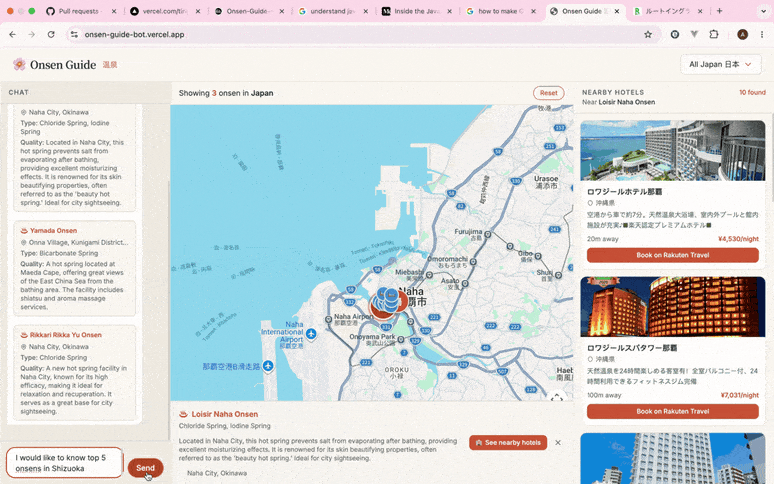

# Onsen Guide Bot

> **Find your perfect Japanese hot spring — in English.**
> A conversational AI that helps English-speaking travellers discover Japanese onsen (hot springs) and real nearby hotels, through chat + an interactive map.

**🔗 [Live Demo](https://onsen-guide-bot.vercel.app/)**




---

## What it does

English-language information about Japanese onsen is scarce and scattered. Onsen Guide Bot lets you simply ask — *"find me a sulfur onsen in Shizuoka"* — and get grounded, English-first answers backed by a real dataset, plotted on a map, with bookable hotels nearby.

- **Conversational, location-aware search** over a curated onsen dataset (RAG).
- **Guide-style recommendations** — ask for a recommendation and it returns grounded **pros/cons per onsen** plus a top pick, reasoned over the candidates it retrieved.
- **Interactive map** — results appear as markers; click a chat result to centre it.
- **Real hotels** — "see nearby hotels" returns live Rakuten Travel listings with prices, images, and booking links.
- **English-first**, with original Japanese names preserved.

> *Example:* "Recommend a quiet onsen near Naha for a couple" → a top pick with reasoning, 3 onsen pinned on the map with pros/cons, and real hotels within reach.

---

## Highlights

The parts I'd bring up in an interview — the engineering, not the feature list:

- **~10× faster by removing the agent.** The V1 LangGraph **ReAct agent** averaged **~35 s** per `/chat`. I traced it, found two GPT-4o round-trips dominating the time, and redesigned it into a **deterministic workflow** — one small intent call + pure-Python assembly — landing at **~3.7 s**. Shipped behind a feature flag for an A/B and instant rollback.
- **Hallucination prevented *structurally*, not by prompting.** Onsen results are assembled in Python from retrieved records; the LLM never invents facts. An **automated eval suite** (LangSmith) scores grounding so "is it honest?" has a number.
- **Cost & latency are observed, not guessed.** Full LangSmith tracing in prod with **per-request cost/token attribution** (~$0.002 search · ~$0.005 recommend), and the expensive recommend LLM call sits behind a gated rollout flag.
- **Production-grade, not a notebook.** Per-IP rate limiting, outbound retry/backoff, fail-closed API-key auth, **312 backend + 126 frontend tests**, CI test gates (including a deterministic eval release gate), and branch-protected releases to Railway + Vercel.

---

## Architecture

The conversational `/chat` path is a **deterministic workflow**, not an open-ended agent. The LLM is used for the two things it's actually good at — understanding intent and making a judgement — while everything factual stays in Python:

```
React (Vite + Tailwind)  ──HTTP──>  FastAPI  ──>  Workflow pipeline
                                                       │
  ① parse_intent   LLM (gpt-4o-mini)   →  { mode: search|recommend|ask, prefecture, query, wants_hotels }
  ② retrieve       pure Python          →  ChromaDB RAG  (semantic rank + prefecture filter)
  ③ analyze        LLM (gpt-4o)         →  grounded pros/cons + recommendation   [recommend mode, gated]
  ④ hotels         passthrough          →  Rakuten Travel  (only when asked)
  ⑤ reply          template             →  typed AgentResponse  { reply, onsens[], hotels[], recommendation }
```

The factual data layer (② ④) never calls an LLM, so it **can't fabricate** — the model only routes (①) and reasons over already-retrieved candidates (③). The original ReAct agent is retained behind a `CHAT_ENGINE` flag for A/B comparison and rollback.

**Strict, one-directional layering** — each layer only knows the one below it:

```
api/  ──>  agent/ (workflow + tools)  ──>  services/  ──>  ChromaDB · Google Maps · Rakuten
```

- Data flows **downward only**: `api → agent → tools → services`.
- `services/` are **framework-agnostic** (zero LangChain imports) so the agent framework is swappable.
- `tools/` are **thin wrappers** — no business logic.
- `core/config.py` is the **single source of truth** for settings (every value that differs local vs prod is an env-overridable field with a local default).

**One deliberate exception:** the `POST /hotels` endpoint (a map click → coordinates-in/hotels-out lookup) calls the service **directly**, skipping the agent — there's no reasoning step to justify LLM latency and token cost. Conversational endpoints go through the workflow; deterministic data endpoints don't.

**Retrieval design:** **one record = one embedding** — onsen are short, atomic entries, so I don't chunk them; a splitter would only fragment a single onsen across vectors. Queries return the top matches (raised from a default of 5 so "all onsen in X" returns a useful list), ranked semantically but constrained by a `prefecture_en` metadata filter (see Challenges #2).

---

## Technical decisions & tradeoffs

The judgement calls I'd defend in a design review.

### 1. A deterministic workflow, *not* an agent — after measuring the agent
**Why I started with ReAct:** query shapes were unknown, so I wrapped geocoding/search/hotels as tools and let `create_react_agent` reason → call tool → observe → repeat. The right call while I didn't yet know what users would ask.
**What measurement showed:** with LangSmith tracing I attributed a 20-onsen query's ~35 s almost entirely to **two GPT-4o round-trips** — one to "observe" the tool output, one to re-serialize it into the response schema. The agent's freedom *was* the latency.
**The redesign:** I replaced the loop with a fixed pipeline — one cheap `gpt-4o-mini` intent call, then **pure-Python assembly** of the retrieved records (no second LLM hop). Same grounded results, **~35 s → ~3.7 s (~10×)**, shipped behind a `CHAT_ENGINE` flag so I could A/B the two engines in prod and roll back instantly.
**The insight I'd articulate:** for V1/V2 this is a *workflow*, not an *agent* — and treating it as one made it faster, cheaper, and impossible to hallucinate facts. True agency (an LLM choosing its own tool path) earns its place back at **V3**, not before.

### 2. The one LLM judgement call that earns its place: the recommend brain
**Why:** a *search* is deterministic, but a *recommendation* is a judgement — "which of these is quietest for a couple?" So `recommend` mode adds a single `gpt-4o` call that reasons over a compact projection of the **already-retrieved** onsen and returns structured pros/cons + a top pick.
**Grounding:** the prompt and the Pydantic schema both constrain it to *"use ONLY the fields provided"* — it judges the candidates, it doesn't invent new ones.
**Rollout as a tradeoff:** it roughly triples per-request cost, so it's behind an `ANALYZE_ENABLED` gate — off returns bare candidates (safe), on adds the reasoning. The flip was a deliberate, measured decision, not a default.

### 3. Geocode once at ingest, not per request
**Why:** the source dataset has no coordinates. V1 geocoded every result at request time via a blocking Google SDK call (parallelised with `asyncio.to_thread`, but still N network calls on the hot path) — the original latency bottleneck.
**The fix:** geocoding moved to **ingest time** — each onsen is geocoded once and its `lat`/`lng` stored in ChromaDB metadata, so the request path does zero geocoding. Measurement showed the real win here was **cost and reliability**, not latency (the `/chat` path is LLM-bound, per #1).

### 4. ChromaDB now, pgvector path kept open
**Why:** ChromaDB got the *whole flow* running fast — for ~220 records it handles vectors *and* metadata filtering with near-zero setup. The right call for the "ship and learn" phase.
**Tradeoff:** it stops being the answer as data grows — beyond a small dataset I'll want relational structure, joins, and transactional consistency across onsen/hotels/regions/preferences. I kept the seam open (a reserved `schema.sql`) to migrate to **pgvector** (vectors *and* a proper relational DB in Postgres) when the data demands it, rather than paying that complexity now.

---

## Evaluation & observability

Treating LLM quality as a **testable, measured property** — the part most demo projects skip.

- **Eval harness ([`backend/scripts/eval_flow.py`](./backend/scripts/eval_flow.py)).** A LangSmith **experiment** over the *real* workflow: a curated dataset (`onsen-flow-evals`) spanning all modes — search, recommend, recommend+hotels, ask, and out-of-data prefectures. Four evaluators score every run:
  - **grounding / no-fabrication** — every returned onsen name must exist in the ChromaDB ground truth; out-of-data queries must return empty.
  - **structural correctness per mode** — recommend ⇒ a recommendation + pros/cons; search ⇒ neither; etc.
  - **cost budget** and **latency** thresholds per mode.

  It exits non-zero on failures (CI-gateable), and routes results to a dedicated LangSmith project so eval traffic stays separate from prod.
- **Tracing & cost.** Every prod `/chat` is a LangSmith trace tagged with engine/version/deploy SHA, with **per-request token cost** attached and sliced by mode — so "what does the recommend feature cost?" is answerable with a number, and model swaps (e.g. gpt-4o vs gpt-4o-mini) can be compared on cost *and* grounding.

---

## Engineering challenges & how I solved them

Most of these were **correctness** and **production** problems — the hard part of shipping an LLM to users, not "make it talk." (Full write-up in [`PROJECT_JOURNEY.md`](./PROJECT_JOURNEY.md).)

### 1. The LLM fabricated data it didn't have
When retrieval returned nothing, GPT-4o cheerfully **invented** plausible onsen and hotels — real-sounding names, fake details, even `example.com` URLs.
**Fix (two layers):** first, anti-fabrication guardrails in *both* the system prompt *and* the structured-output schema — every result must come verbatim from tool output, empty means empty. Then, the bigger structural fix: the workflow redesign (#1) **assembles onsen in Python from retrieved records**, so the model no longer has the *opportunity* to fabricate facts. Honesty became a property of the architecture, not just the prompt.

### 2. RAG semantic search ignored location
Pure vector similarity would return an Okinawa onsen for a "Tokyo" query — embeddings capture *vibe*, not *place*.
**Fix:** a ChromaDB metadata `where` filter on `prefecture_en`, extracted from the user's message. **Semantic ranking *within* a hard location constraint.**

### 3. The agent was slow — and I could prove exactly why
A 20-onsen query took ~35 s and I was guessing at the cause.
**Fix:** wired **LangSmith tracing** and attributed the time to two GPT-4o round-trips, then redesigned the agent into the deterministic workflow (#1) — **~35 s → ~3.7 s**, verified with a live A/B behind a flag. *Measure, then optimise* — not the other way round.

### 4. App and ingest wrote to different databases (prod-only bug)
In the Railway container, `/chat` returned zero results despite a "successful" ingest — the app and the ingest job computed the ChromaDB path independently and diverged.
**Fix:** made `settings.chroma_path` the single source of truth and had ingest import the **same** `get_collection()` the app uses, with regression tests asserting they resolve to the same path.

### 5. A public endpoint that spends money on every call
`/chat` triggers paid GPT-4o + embedding requests, so an open endpoint is an open door to cost abuse.
**Fix:** a **fail-closed** `X-API-Key` guard (constant-time, `/health` left open) *plus* server-side **per-IP rate limiting** on the paid routes and bounded retries/backoff on outbound calls. The honest caveat I'd still flag: the API key ships in the client bundle (a SPA can't hold a secret), so it deters casual abuse — the real protection is the server-side rate limit + spend caps, which a client can't bypass.

> More in the journey doc: brittle ingestion on real-world data, production papercuts (CORS, Vercel monorepo, build-time env inlining), and a model-swap eval that showed `gpt-4o-mini` *wasn't* a safe drop-in for the agent.

---

## Status & limitations

**V2.5 is live in production** — the deterministic workflow, guide-style recommendations, the `ask` knowledge base, evals, and observability are all shipped and running. **V3 (the trip-planner agent) is now kicking off** — see the [design plan](./docs/v3-trip-planner-plan.md). I'd rather name the remaining gaps than hide them:

**Shipped since V1** (were the V1 limitations): ingest-time geocoding · the `ask`-mode knowledge base · LangSmith eval harness, now a **deterministic CI release gate** · tracing + per-request cost accounting · rate limiting + outbound resilience · the workflow redesign.

**Still open (conscious tradeoffs, with paths forward):**
- **Chat history is in-memory** — lost on restart, not multi-instance safe. → a persistent session store (SQLite local / Postgres prod) — this is **V3 Step 0**, the hard prerequisite for the trip-planner ([plan](./docs/v3-trip-planner-plan.md)).
- **Map-click hotels surface in Japanese.** The Rakuten API returns Japanese-only data; the `/chat` path translates it, but the deterministic `/hotels` endpoint skips the agent for speed, so its hotels come back untranslated. → a `translation_service` that translates once and **caches by Rakuten hotel id**, so both paths get English cheaply.
- **Pros/cons groundedness is not gated.** I built an **LLM-as-judge** evaluator for it, then **parked** it: judging LLM-written prose while the flow and data are still moving produced non-deterministic false-negatives that blocked clean releases. The release gate is **deterministic-only** for now (name-grounding, structure, cost, latency); the judge is kept for re-enable once V3 stabilises and real ratings (Google Places) ground the pros/cons.

---

## Roadmap

**V2 / V2.5 — done & live**
- ReAct → deterministic workflow (measured ~10× latency win, flagged for A/B).
- 3-mode router (search · recommend · **ask**) + the recommend brain (grounded pros/cons + recommendation).
- **`ask` knowledge base** — markdown onsen knowledge (etiquette, tattoo policy, spring-type benefits) in a separate Chroma collection, served by semantic RAG (live, `ASK_ENABLED=true`).
- LangSmith tracing + per-request cost accounting; a LangSmith eval harness, now a **deterministic release gate** in CI (LLM-as-judge parked until the flow + data stabilise).
- Hardening: rate limiting, outbound retries/backoff; CI test gates + branch-protected releases.

**V3 — kicking off: the trip-planner agent**
The first true *agent* — dynamic tool sequencing + re-planning — for the one query the workflow can't serve: *"plan me a 3-day onsen trip."* **Single agent first; multi-agent only if it strains.**
- **Step 0 — persistent session state** (the hard prerequisite): a bespoke session store, SQLite local / Postgres prod, replacing the in-memory single-worker history.
- **Slot-filling** (regions · nights · dates · party · budget · prefs) + a LangGraph agent over **Google-API tools** — Places (reviews/ratings, to *ground* pros/cons in real signal), Distance Matrix/Directions (travel-time / re-planning), weather — plus the existing onsen/hotel/analyze tools.
- **Multi-turn / trajectory agent evals**, measured against the workflow baseline.
- Migrate chat GPT-4o → **Claude (Sonnet 4.6 / Opus 4.8)** with a provider fallback chain; pgvector when scale demands it.

Full design: [`docs/v3-trip-planner-plan.md`](./docs/v3-trip-planner-plan.md). Earlier notes: [`docs/V2_IMPLEMENTATION_PLAN.md`](./docs/V2_IMPLEMENTATION_PLAN.md) · [`docs/v2-slot-filling-agent.md`](./docs/v2-slot-filling-agent.md).

---

## Run it locally

Two servers run side by side, each from its own directory.

**Backend** — FastAPI on port 8000:
```bash
cd backend
python -m venv .venv && source .venv/bin/activate
pip install -r requirements.txt
.venv/bin/uvicorn api.main:app --reload --port 8000
```
Requires `backend/.env` (see [`.env.example`](./.env.example)):
```
OPENAI_API_KEY=...         # embeddings + GPT-4o (chat/recommend) + gpt-4o-mini (intent)
GOOGLE_MAPS_API_KEY=...     # geocoding (at ingest)
RAKUTEN_APP_ID=...          # Rakuten Travel API
RAKUTEN_ACCESS_KEY=...
API_KEY=...                 # the X-API-Key guard
# Optional — feature flags & observability (sensible local defaults):
CHAT_ENGINE=workflow        # "workflow" (default in prod) | "react" (legacy, for A/B)
ANALYZE_ENABLED=true        # on = recommend brain returns pros/cons + recommendation
LANGSMITH_TRACING=true      # + LANGSMITH_API_KEY to trace runs / run evals
```
Health check: `GET http://localhost:8000/health`.

**Frontend** — Vite + React on port 5173:
```bash
cd frontend
nvm use            # Node 20.16.0 (Vite 5 needs Node 18+)
npm install
npm run dev
```
Requires `frontend/.env`:
```
VITE_API_URL=http://localhost:8000
VITE_GOOGLE_MAPS_API_KEY=...
VITE_API_KEY=...           # matches the backend API_KEY
```

**Tests:** `pytest` in `backend/` (312 tests, external I/O mocked) · `npm test` in `frontend/` (126 Vitest + RTL tests).
**Evals (paid):** `.venv/bin/python scripts/eval_flow.py` from `backend/` — runs the LangSmith flow-eval experiment (needs `LANGSMITH_API_KEY`).

---

## Stack

**Backend:** FastAPI · deterministic LangGraph/LCEL workflow (legacy ReAct agent retained behind a flag) · GPT-4o + `gpt-4o-mini` + `text-embedding-3-small` · ChromaDB · Pydantic · LangSmith (tracing + evals)
**Frontend:** React 18 · Vite 5 · Tailwind · `@react-google-maps/api`
**Data:** ~220 onsen (Okinawa + Tokai), Japanese→English translated at ingest via `gpt-4o-mini`, geocoded once at ingest, embedded with prefecture/city/spring-type metadata
**Integrations:** Google Maps (geocoding + JS map) · Rakuten Travel API (live hotels) — displayed with the required [Rakuten Web Service credit badge](https://webservice.rakuten.co.jp/guide/credit) per their attribution terms
**Infra:** Railway (backend, persistent ChromaDB volume) · Vercel (frontend) · GitHub Actions CI (test gates) · branch-protected `main`

---

*V2.5 is live in production. Full build narrative — the decisions, the measured wins, and the dead ends — in [`PROJECT_JOURNEY.md`](./PROJECT_JOURNEY.md).*
