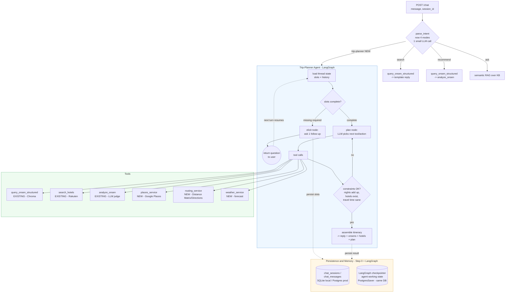

# V3 Trip-Planner Agent — Design Plan

> Status: **draft / scoping** (2026-06-21). The trip-planner is the **4th capability** added to the
> existing 3-mode workflow (`backend/agent/workflow/pipeline.py`), and the **first true agent** in the
> project (dynamic tool sequencing + re-planning) — justified by the autonomy ladder because the tool
> order for a multi-day trip is not knowable up front. **Single agent first**; multi-agent only if one
> agent visibly strains.

---

## 0. Why this is an agent (and the prerequisite)

The live `/chat` path is a deterministic workflow: `parse_intent` (one small LLM call in
`backend/agent/workflow/intent.py`) routes to a fixed branch (`search`/`recommend`/`ask`) whose tool
order is hard-coded in `run_workflow`. A trip plan is different: "5 nights in Gifu and Nagano, hot
springs with mountain views, not too much driving between stops" requires the model to decide *which
tools to call, in what order, and whether to re-plan* when a constraint fails (no hotel near the chosen
onsen; a stop is 4h from the next). That is the agent rung of the ladder.

**Hard prerequisite — Step 0 (persistence).** Slot-filling means multi-turn elicitation, and the
current history store is **in-memory, single-process** (`backend/services/chat/chat_service.py`, a
module-level `_history: dict`). Step 0 (bespoke `chat_sessions`/`chat_messages`, SQLite local / Postgres
prod, behind `session_store_backend`, preserving the `get_history`/`save_message` seam) MUST land first.
See `docs/` Step-0 notes / memory `project_v3_readiness_plan`.

---

## 1. Architecture

Routing stays in `parse_intent` — add a 4th `Literal` value `"trip"` to `Intent.mode`
(`backend/agent/workflow/intent.py`) and a branch in `run_workflow`
(`backend/agent/workflow/pipeline.py`) dispatching to a new `backend/agent/trip/` module (sibling of
`agent/workflow/`), keeping `services/` LangChain-agnostic.

---

## 2. Slot-filling schema ("what needs to be filled")

A `TripSlots` Pydantic model (`backend/agent/trip/slots.py`). Required slots block planning; optional
slots refine with sensible defaults.

| Slot | Type | Required? | How elicited | Default / null behavior |
|---|---|---|---|---|
| `regions` | `list[str]` (English prefectures) | **Required** | From message; else ask "Which area(s)?" | Validated against ingested prefectures (reuse `eval_flow.build_ground_truth` set logic) — don't plan where there's no data. |
| `nights` | `int` | **Required** | From message ("5 nights"); else ask | Drives itinerary length / nights-add-up check. |
| `dates_or_season` | ISO date range OR season label | **Required** | From message; else ask "When?" | Season fallback ("autumn") OK; needed for weather. |
| `party` | `enum{solo,couple,family,friends}` | Optional | From message | Default `couple`. Feeds `analyze_onsen` prefs + hotel choice. |
| `budget` | `enum{budget,mid,luxury}` or JPY | Optional | From message | Default `mid`. Sorts hotels. |
| `spring_or_scenery_prefs` | free text | Optional | From message | Default `""`. Maps onto semantic `query` + `spring_benefits.py`. |
| `mobility_transport` | `enum{car,train,mixed}` | Optional | From message | Default `mixed`. Drives Distance Matrix `mode` + re-plan penalty. |
| `must_haves` | `list[str]` ("private bath", "tattoo-friendly") | Optional | From message | Default `[]`. Cross-checked vs KB (`tattoo_policy`) + descriptions. |
| `pace` | `enum{relaxed,packed}` | Optional | From message | Default `relaxed` → ~1 onsen-stop/night. |

**Elicit-loop.** Each turn: (1) merge the new message into `TripSlots` via a structured-output
extraction call (reuse the `parse_intent` pattern, `with_structured_output(TripSlots)`); (2) compute
missing **required** slots; (3) if any missing, the **elicit node** returns ONE focused follow-up and
stops (no tool calls, cheap); (4) the next turn re-enters with prior slots loaded from state. This is
why Step 0 is a hard prerequisite.

**Where slot state lives (two tiers):** raw conversation → Step-0 session store (replayed via
`get_history`); structured `TripSlots` + intermediate tool results → LangGraph **agent working state**,
checkpointed per `thread_id = session_id` (`PostgresSaver` prod / `MemorySaver` local).

---

## 3. Tools (Google-APIs-first)

Each new capability = a framework-agnostic service under `services/{name}/{name}_service.py`; thin
`@tool` wrappers under `agent/trip/tools/` bind them for the agent. All use the shared retry helper.

### Reused as-is
- **`query_onsen_structured`** (`services/retrieval/retrieval_service.py`) — onsen candidates per region. Free, request-time.
- **`search_hotels`** (`services/rakuten/rakuten_service.py`) — lodging near a chosen onsen; already fail-soft. Keys set.
- **`analyze_onsen`** (`agent/workflow/analyze.py`) — grounded ranking + pros/cons per region/day.

### New (Google-first)

| Tool | Service module | API / key | Time | V3-now? | Gate |
|---|---|---|---|---|---|
| Places (ratings/reviews/photos) | `services/places` (new) | Google Places | **ingest** | yes | **STOP: billing/SKU** |
| Distance Matrix / Directions | `services/routing` (new) | Google Maps | request (cached) | yes | **STOP if SKU off** |
| Weather | `services/weather` (new) | Open-Meteo (keyless) | request | later (V3.1) | none |

- **Places** grounds recommendations in real ratings/reviews — this *is* the long-parked `ratings_service`
  idea (Google Places, ingest-time). Add `scripts/enrich_places.py` (mirrors `scripts/geocode_jsonl.py`)
  writing `rating`/`reviews_count`/`place_id` into Chroma metadata once → free at plan time + lets eval
  ground "rating is real". May reuse `google_maps_api_key` if Places is enabled — **confirm billing**.
- **Routing** answers travel-time/"traffic" between stops; reuse `google_maps_api_key`. This is the tool
  that makes the agent **re-plan** (leg > threshold for the chosen pace → re-order/drop a stop). Cache
  per coordinate-pair in agent state across re-plans.
- **Weather** — recommend **Open-Meteo** (free, keyless) for V3 to avoid a billing gate; advisory only,
  never blocks the plan. Defer to V3.1 until the core flow (onsen + hotel + routing) is proven.

---

## 4. Memory management

- **(a) Short-term conversation memory** — Step-0 session store (`chat_sessions`/`chat_messages`).
  Every turn persists via `save_message`; replayed via `get_history`. Optionally window the replay to the
  last N turns to bound tokens.
- **(b) Agent working state** — `TripSlots` + intermediate tool results (candidates, distance cache,
  hotel sets, draft itinerary) as **LangGraph state**, checkpointed per `thread_id = session_id`
  (`MemorySaver` local / `PostgresSaver` prod, **same Postgres** as Step 0). Env-split
  `trip_checkpointer_backend`. Prunable once a plan is delivered (reconstructable from the transcript).
- **(c) Long-term / cross-session memory (user prefs)** — **DEFERRED, out of scope for V3.** Sessions are
  anonymous today. Future hook: a `user_preferences` table keyed by a future user id. Do not build now.

---

## 5. Agent evaluation

Today's gate (`backend/scripts/eval_flow.py`) is **single-turn, deterministic** (`grounding`,
`structure`, `cost_budget`, `latency`); LLM-judge evaluators are **parked**. Keep that discipline — an
agent eval asserts what's **deterministically checkable** and avoids grading free prose for the gate.

Extend examples from a single `message` to a **conversation thread** (`messages: list[str]`) run through
one `session_id`/`thread_id`, exercising the elicit-loop + re-planning. New deterministic evaluators:

1. **Slot-filling completeness** — all required slots filled; a follow-up was asked iff a required slot was missing.
2. **Tool-selection correctness** — from the LangSmith run tree: onsen chosen before hotel; routing called when multi-stop. Assert presence/ordering, not exact args.
3. **Re-plan on constraint failure** — seed a thread whose naive plan violates a constraint; assert a 2nd `plan` iteration fired.
4. **Final-plan validity** (core gate) — all onsen real/in-region (extend `grounding`); **nights add up**; **hotels exist** per lodging night (or an explicit "none found", never fabricated).
5. **Cost & latency vs the workflow baseline** — new `trip` budget bucket; **measure the agent vs the workflow** (instrument → baseline → prove), same discipline as the V2 redesign.

**Non-determinism:** plan prose can't be string-matched and LLM-judge is parked, so the gate asserts
**structure + trajectory** (counts, ordering, region membership, nights arithmetic, hotel existence,
re-plan occurrence) from the run tree. Re-enable LLM-judge prose grading later via the same `EVALUATORS`
mechanism once the flow stabilises.

---

## 6. Single-agent-first build sequence (PR-sized, each into `develop`)

1. **PR 1 — Step 0 persistence (prerequisite).** Bespoke tables; SQLite local + Postgres prod behind `session_store_backend`; preserve the seam. **STOP: Railway Postgres provisioning.**
2. **PR 2 — routing seam + `trip` mode stub.** Add `"trip"` to `Intent.mode` + a `run_workflow` branch to `agent/trip/agent.py` placeholder, gated by `trip_enabled=False` (mirror `analyze_enabled`). Ships dead.
3. **PR 3 — minimal trip-planner: slots + onsen tool only.** `TripSlots`, extraction call, elicit-loop, naive itinerary. `MemorySaver` local / `PostgresSaver` behind `trip_checkpointer_backend`. Prove the multi-turn flow.
4. **PR 4 — agent eval (multi-turn).** Extend `eval_flow.py` to thread examples + the §5 deterministic evaluators. Baseline vs recommend mode. Gate before adding tools.
5. **PR 5 — add hotels (`search_hotels`)** per lodging night; add "hotels exist" eval check.
6. **PR 6 — Places enrichment (ingest-time).** `services/places/` + `scripts/enrich_places.py`. Surface + ground ratings. **STOP: Google Places billing/SKU.**
7. **PR 7 — routing + re-planning.** `services/routing/`; re-plan loop on long legs + re-plan eval. **STOP if Distance Matrix/Directions SKU off.**
8. **PR 8 — model migration (GPT-4o → Claude Sonnet 4.6 / Opus 4.8) + fallback chain.** Heaviest reasoning path is the natural hook; `langchain-anthropic` already present; env-split `chat_model`/`analyze_model`. Measure before flipping. **STOP: cost/behavior decision.**
9. **PR 9 — weather (V3.1, optional).** `services/weather/` (Open-Meteo, keyless), advisory annotations.
10. **Future — multi-agent (NOT now).** Only if the single agent visibly strains (prompt balloons past reliable tool-selection; genuinely parallel sub-goals). Prove the single agent first.

**Consolidated STOP-and-ask points:** Postgres provisioning (PR1); Google Places billing/SKU (PR6);
Distance Matrix/Directions SKU (PR7); model migration (PR8); any non-additive change to the `/chat`
response contract (adding a `plan` field must stay additive).

---

## Open product decisions (not yet settled)
- **`session_id` per-conversation UUID** — today `session_id` defaults to `"default"` (`api/routes/chat.py`), so all users share one history bucket. Once history is durable, the frontend must send a unique id. Settle before PR1's prod cutover.
- **Google API billing** — confirm Places + Distance Matrix/Directions SKUs are enabled (may share the existing Maps key/project).
- **Model migration timing** — whether to migrate to Claude during V3 (PR8) or hold.
- **Long-term user memory** — deferred; revisit if/when accounts exist.
