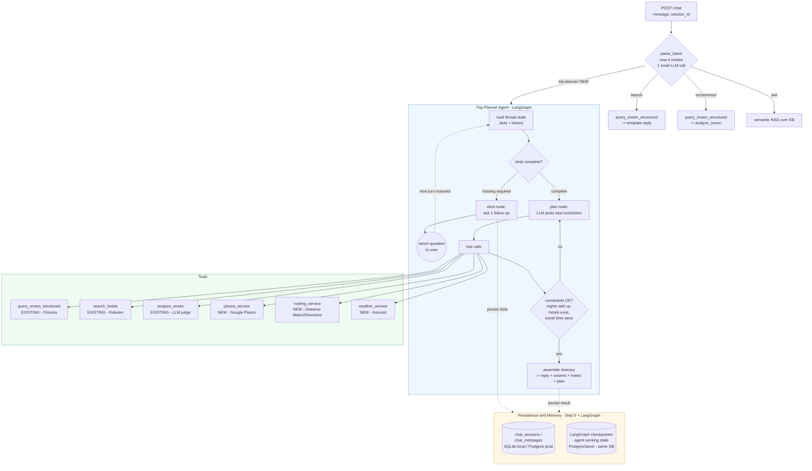

# V3 Trip-Planner Agent — Design Plan

> Status: **SHIPPED & LIVE IN PROD** (`trip_enabled=true`, flipped and smoke-tested 2026-08-29).
> Originally drafted 2026-06-21. The trip-planner is the **4th capability** added to the
> existing 3-mode workflow (`backend/agent/workflow/pipeline.py`), and the **first true agent** in the
> project (dynamic tool sequencing + re-planning) — justified by the autonomy ladder because the tool
> order for a multi-day trip is not knowable up front. **Single agent first**; multi-agent only if one
> agent visibly strains (not yet needed).
>
> **What shipped:** PR1 (persistence) → PR2 (routing stub) → PR3a/b/c (LangGraph skeleton, slots +
> elicit-loop, naive itinerary) → PR4 (multi-turn eval) → PR5 (hotels) → PR7 (haversine routing +
> re-planning, done *before* PR6 — see §6 note) → pc1 (grounded `analyze` recommendation step) are all
> live. **Deferred:** PR6 (Places ratings — billing decision), PR8 (Claude migration), PR9 (weather).
> See §6 for the full per-PR checklist and `PROJECT_JOURNEY.md` challenge #12 for *why* PR7 shipped
> deterministic rather than an LLM tool-caller. Next-step planning: `docs/next-steps.md`.

---

## 0. Why this is an agent (and the prerequisite)

The live `/chat` path is a deterministic workflow: `parse_intent` (one small LLM call in
`backend/agent/workflow/intent.py`) routes to a fixed branch (`search`/`recommend`/`ask`) whose tool
order is hard-coded in `run_workflow`. A trip plan is different: "5 nights in Gifu and Nagano, hot
springs with mountain views, not too much driving between stops" requires the model to decide *which
tools to call, in what order, and whether to re-plan* when a constraint fails (no hotel near the chosen
onsen; a stop is 4h from the next). That is the agent rung of the ladder.

**Hard prerequisite — Step 0 (persistence).** Slot-filling means multi-turn elicitation, and the
current history store is **in-memory, single-process** (`backend/services/chat/chat_service.py`, a
module-level `_history: dict`). Step 0 (bespoke `chat_sessions`/`chat_messages`, SQLite local / Postgres
prod, behind `session_store_backend`, preserving the `get_history`/`save_message` seam) MUST land first.
See `docs/` Step-0 notes / memory `project_v3_readiness_plan`.

### Step 0 — persistence library decision (2026-07-10)

**Chosen: SQLAlchemy Core** for the session store (not raw `sqlite3`+`psycopg`, not an ORM like
SQLModel). "Bespoke" above means *our own `chat_sessions`/`chat_messages` tables* (vs. reusing
LangChain's message-history stores or the LangGraph checkpointer for conversation history) — it does
**not** mandate hand-rolled SQL. SQLAlchemy Core still gives bespoke tables while generating the
dialect-correct DDL/queries.

Why: one query path serves **both** engines (local SQLite / prod Postgres), so (1) there is a single
set of schema + queries + connection factory to maintain — not two hand-synced backends — and (2) a
prod-only Postgres bug is reproducible locally by pointing the *same* code at a local Postgres, only
changing the connection URL. Residual SQLite↔Postgres dialect gaps (types, timestamps, concurrent-write
locking) are covered by that on-demand local-Postgres run, not assumed away.

Env-split refinement: the switch is a **`session_db_url`** setting (a URL string that also selects the
dialect — `sqlite:///…` local default, `postgresql://…` in prod via Railway env), which supersedes the
`session_store_backend` flag named above. New deps: `sqlalchemy` + `psycopg`. Local default keeps the
two-command "Running Locally" flow (SQLite file, zero setup); Railway overrides the URL. **STOP points
unchanged:** Railway Postgres provisioning, and the frontend `session_id`→per-conversation UUID cutover.

### LangGraph adoption decision (2026-07-11)

**Chosen: adopt a hand-built LangGraph `StateGraph` at PR3** (not deferred to PR7's re-planning).
LangGraph is already a dependency (`backend/requirements.txt`, `langgraph>=0.2.0`); the deterministic
search/recommend/ask workflow path is LangGraph-free, so the trip `StateGraph` is the **only use of
LangGraph in the production path**. (Historically LangGraph also backed the V1 ReAct agent, since
removed.)

Why adopt now rather than build PR3 in plain Python and convert later: the throwaway cost of deferring
is narrow but real — a bespoke `TripSlots` persistence mechanism written for PR3 that PR7's checkpointer
would subsume. Adopting the graph now means the elicit-loop lives in nodes and working state lives in
the checkpointer from day one, so nothing is ripped out. This is consistent with — not a violation of —
the incremental-slicing philosophy: adopt the framework on the *simple* flow (slots + naive itinerary),
extend to the *hard* flow (re-planning) later. The agent's real purpose is **conversational elicitation**
(helping a customer discover the trip they actually want), which is precisely the elicit-loop the graph
carries.

**Re-planning-readiness — PR3's graph MUST have these four properties so PR7 re-planning is purely
additive (an edge + a node, not a reshape):**

1. **Hand-built `StateGraph`, not a prebuilt agent graph.** The prebuilt is a throwaway; the hand-built
   graph is the keeper PR7 extends.
2. **Accumulating working state from day one** — state holds `TripSlots` *and* placeholders for
   `candidates` / `itinerary` even though PR3 only fills slots. PR7 then adds `distance_cache` and
   `replan_count` as new *fields*, not a new state concept.
3. **A discrete `plan` node even for the naive itinerary**, so PR7's re-plan is "add a
   `check_constraints` node + a conditional back-edge into the existing `plan` node."
4. **Checkpointer wired from PR3** (`MemorySaver` local; `PostgresSaver` prod deferred behind
   `trip_checkpointer_backend` until Railway Postgres from PR1 exists).

This also resolves the "two persistence systems, is it redundant?" question: the Step-0 store holds the
**transcript**, the checkpointer holds the **agent working state** — distinct roles, no hand-rolled
overlap, because we never build the bespoke slot store.

---

## 1. Architecture

```mermaid
flowchart TD
    U[POST /chat<br/>message, session_id] --> R{parse_intent<br/>now 4 modes<br/>1 small LLM call}

    R -->|search| SR[query_onsen_structured<br/>-> template reply]
    R -->|recommend| RC[query_onsen_structured<br/>-> analyze_onsen]
    R -->|ask| AK[semantic RAG over KB]
    R -->|trip-planner NEW| TP

    subgraph TP[Trip-Planner Agent - LangGraph]
        direction TB
        S0[load thread state<br/>slots + history] --> SC{slots complete?}
        SC -->|missing required| EL[elicit node:<br/>ask 1 follow-up] --> RET((return question<br/>to user))
        SC -->|complete| PL[plan node:<br/>LLM picks next tool/action]
        PL --> TC[tool calls]
        TC --> RP{constraints OK?<br/>nights add up,<br/>hotels exist,<br/>travel time sane}
        RP -->|no| PL
        RP -->|yes| AS[assemble itinerary<br/>-> reply + onsens + hotels + plan]
    end

    EL -.persist slots.-> MEM
    AS -.persist result.-> MEM
    RET -.next turn resumes.-> S0

    subgraph TOOLS[Tools]
        direction TB
        T1[query_onsen_structured<br/>EXISTING - Chroma]
        T2[search_hotels<br/>EXISTING - Rakuten]
        T3[analyze_onsen<br/>EXISTING - LLM judge]
        T4[places_service<br/>NEW - Google Places]
        T5[routing_service<br/>NEW - Distance Matrix/Directions]
        T6[weather_service<br/>NEW - forecast]
    end

    TC --> T1 & T2 & T3 & T4 & T5 & T6

    subgraph MEM[Persistence and Memory - Step 0 + LangGraph]
        direction TB
        M1[(chat_sessions /<br/>chat_messages<br/>SQLite local / Postgres prod)]
        M2[(LangGraph checkpointer<br/>agent working state<br/>PostgresSaver - same DB)]
    end

    style TP fill:#eef7ff,stroke:#4a90d9
    style MEM fill:#fff7e6,stroke:#d9a441
    style TOOLS fill:#eefbf0,stroke:#46a86c
```

Routing stays in `parse_intent` — add a 4th `Literal` value `"trip"` to `Intent.mode`
(`backend/agent/workflow/intent.py`) and a branch in `run_workflow`
(`backend/agent/workflow/pipeline.py`) dispatching to a new `backend/agent/trip/` module (sibling of
`agent/workflow/`), keeping `services/` LangChain-agnostic.

---

## 2. Slot-filling schema ("what needs to be filled")

A `TripSlots` Pydantic model (`backend/agent/trip/slots.py`). Required slots block planning; optional
slots refine with sensible defaults.

| Slot | Type | Required? | How elicited | Default / null behavior |
|---|---|---|---|---|
| `regions` | `list[str]` (English prefectures) | **Required** | From message; else ask "Which area(s)?"; if named but unknown/non-Japan → the region-invalid ask | Validated against the ingested-prefecture set at slot-fill (see "Region validation" below) — reject unknown regions early, don't plan where there's no data. |
| `nights` | `int` | **Required** | From message ("5 nights"); else ask | Drives itinerary length / nights-add-up check. |
| `dates_or_season` | ISO date range OR season label | **Required** | From message; else ask "When?" | Season fallback ("autumn") OK; needed for weather. |
| `party` | `enum{solo,couple,family,friends}` | Optional | From message | Default `couple`. Feeds `analyze_onsen` prefs + hotel choice. |
| `budget` | `enum{budget,mid,luxury}` or JPY | Optional | From message | Default `mid`. Sorts hotels. |
| `spring_or_scenery_prefs` | free text | Optional | From message | Default `""`. Maps onto semantic `query` + `spring_benefits.py`. |
| `mobility_transport` | `enum{car,train,mixed}` | Optional | From message | Default `mixed`. Drives Distance Matrix `mode` + re-plan penalty. |
| `must_haves` | `list[str]` ("private bath", "tattoo-friendly") | Optional | From message | Default `[]`. Cross-checked vs KB (`tattoo_policy`) + descriptions. |
| `pace` | `enum{relaxed,packed}` | Optional | From message | Default `relaxed` → ~1 onsen-stop/night. |

**Elicit-loop.** Each turn: (1) merge the new message into `TripSlots` via a structured-output
extraction call (reuse the `parse_intent` pattern, `with_structured_output(TripSlots)`); (2) compute
missing **required** slots; (3) if any missing, the **elicit node** returns ONE focused follow-up and
stops (no tool calls, cheap); (4) the next turn re-enters with prior slots loaded from state. This is
why Step 0 is a hard prerequisite.

**Where slot state lives (two tiers):** raw conversation → Step-0 session store (replayed via
`get_history`); structured `TripSlots` + intermediate tool results → LangGraph **agent working state**,
checkpointed per `thread_id = session_id` (`PostgresSaver` prod / `MemorySaver` local).

**Region validation — enforced at slot-fill (decision 2026-07-12, "reject early").** A region is valid
only if it is in the set of prefectures actually INGESTED in Chroma — the distinct `prefecture_en`
values, exposed as `services/retrieval/retrieval_service.py::known_prefectures()` (a small `lru_cache`d
helper; sourced from `services/` so `agent/` never imports the eval script). At slot-fill the graph
routes to `elicit` whenever a required slot is missing **OR** any named region is unknown/non-Japan, so:

- an unknown region (e.g. "California") is rejected with a tailored message — *"California isn't
  somewhere I cover — I only plan Japanese onsen trips. Which Japanese prefecture(s)…"* — before the
  plan node, and
- a **mixed** request ("Gifu and Texas") does **NOT** silently build the Gifu-only itinerary; the whole
  turn becomes a region-elicit turn naming Texas.

Region validity is part of the `regions` required-slot being satisfied (precedence: missing regions →
the generic "Which area(s)?" ask; present-but-invalid → the region-invalid ask; present-and-all-valid →
satisfied). Correction terminates: because `merge_slots` REPLACES the regions list with the extraction's
full intended list, a valid follow-up ("just Gifu") drops the stale invalid region and the flow proceeds
to plan. The plan-node no-data guard in `itinerary.py` ("No onsen found for X") is KEPT as
belt-and-suspenders now that validation is upstream.

---

## 3. Tools (Google-APIs-first)

Each new capability = a framework-agnostic service under `services/{name}/{name}_service.py`. All use
the shared retry helper.

**How the graph invokes them — direct `services/` calls (default), not a wrapper layer.** As built in
PR3c, graph nodes call `services/` functions **directly** (e.g. `itinerary.py` → `query_onsen_structured`),
matching the workflow's no-wrapper layering; PR5/PR6 add hotels/Places the same way. There is **no
`agent/trip/tools/` `@tool` wrapper layer today, and none is needed** for deterministic orchestration.
A `@tool`-binding layer becomes relevant **only if** we deliberately make PR7's `plan` node an
**LLM tool-caller** (the model chooses which tool to invoke) — a conscious decision at PR7. If we keep
re-planning deterministic (a Python loop over service calls, the least-autonomy default), we never
introduce it. (The now-deleted `agent/tools/` was ReAct-only plumbing, unrelated to this.)

### Reused as-is
- **`query_onsen_structured`** (`services/retrieval/retrieval_service.py`) — onsen candidates per region. Free, request-time.
- **`search_hotels`** (`services/rakuten/rakuten_service.py`) — lodging near a chosen onsen; already fail-soft. Keys set.
- **`analyze_onsen`** (`agent/workflow/analyze.py`) — grounded ranking + pros/cons per region/day.

### New (Google-first)

| Tool | Service module | API / key | Time | V3-now? | Gate |
|---|---|---|---|---|---|
| Places (ratings/reviews/photos) | `services/places` (new) | Google Places | **ingest** | yes | **STOP: billing/SKU** |
| Distance Matrix / Directions | `services/routing` (new) | Google Maps | request (cached) | yes | **STOP if SKU off** |
| Weather | `services/weather` (new) | Open-Meteo (keyless) | request | later (V3.1) | none |

- **Places** grounds recommendations in real ratings/reviews — this *is* the long-parked `ratings_service`
  idea (Google Places, ingest-time). Add `scripts/enrich_places.py` (mirrors `scripts/geocode_jsonl.py`)
  writing `rating`/`reviews_count`/`place_id` into Chroma metadata once → free at plan time + lets eval
  ground "rating is real". May reuse `google_maps_api_key` if Places is enabled — **confirm billing**.
- **Routing** answers travel-time/"traffic" between stops; reuse `google_maps_api_key`. This is the tool
  that makes the agent **re-plan** (leg > threshold for the chosen pace → re-order/drop a stop). Cache
  per coordinate-pair in agent state across re-plans.
- **Weather** — recommend **Open-Meteo** (free, keyless) for V3 to avoid a billing gate; advisory only,
  never blocks the plan. Defer to V3.1 until the core flow (onsen + hotel + routing) is proven.

---

## 4. Memory management

- **(a) Short-term conversation memory** — Step-0 session store (`chat_sessions`/`chat_messages`).
  Every turn persists via `save_message`; replayed via `get_history`. Optionally window the replay to the
  last N turns to bound tokens.
- **(b) Agent working state** — `TripSlots` + intermediate tool results (candidates, distance cache,
  hotel sets, draft itinerary) as **LangGraph state**, checkpointed per `thread_id = session_id`
  (`MemorySaver` local / `PostgresSaver` prod, **same Postgres** as Step 0). Env-split
  `trip_checkpointer_backend`. Prunable once a plan is delivered (reconstructable from the transcript).
- **(c) Long-term / cross-session memory (user prefs)** — **DEFERRED, out of scope for V3.** Sessions are
  anonymous today. Future hook: a `user_preferences` table keyed by a future user id. Do not build now.

---

## 5. Agent evaluation

Today's gate (`backend/scripts/eval_flow.py`) is **single-turn, deterministic** (`grounding`,
`structure`, `cost_budget`, `latency`); LLM-judge evaluators are **parked**. Keep that discipline — an
agent eval asserts what's **deterministically checkable** and avoids grading free prose for the gate.

Extend examples from a single `message` to a **conversation thread** (`messages: list[str]`) run through
one `session_id`/`thread_id`, exercising the elicit-loop + re-planning. New deterministic evaluators:

1. **Slot-filling completeness** — all required slots filled; a follow-up was asked iff a required slot was missing.
2. **Tool-selection correctness** — from the LangSmith run tree: onsen chosen before hotel; routing called when multi-stop. Assert presence/ordering, not exact args.
3. **Re-plan on constraint failure** — seed a thread whose naive plan violates a constraint; assert a 2nd `plan` iteration fired.
4. **Final-plan validity** (core gate) — all onsen real/in-region (extend `grounding`); **nights add up**; **hotels exist** per lodging night (or an explicit "none found", never fabricated).
5. **Cost & latency vs the workflow baseline** — new `trip` budget bucket; **measure the agent vs the workflow** (instrument → baseline → prove), same discipline as the V2 redesign.

**Non-determinism:** plan prose can't be string-matched and LLM-judge is parked, so the gate asserts
**structure + trajectory** (counts, ordering, region membership, nights arithmetic, hotel existence,
re-plan occurrence) from the run tree. Re-enable LLM-judge prose grading later via the same `EVALUATORS`
mechanism once the flow stabilises.

---

## 6. Single-agent-first build sequence (PR-sized, each into `develop`)

1. ✅ **PR 1 — Step 0 persistence (prerequisite).** Bespoke tables; SQLite local + Postgres prod behind `session_store_backend`; preserve the seam. Shipped as SQLAlchemy Core, `session_db_url`. **`PostgresSaver` still unimplemented** (raises `NotImplementedError`) — Railway Postgres never got provisioned; local `MemorySaver` is what's actually running in prod today (fine at current traffic/single-worker; revisit if scale demands it).
2. ✅ **PR 2 — routing seam + `trip` mode stub.** Shipped, then superseded by PR3.
3. ✅ **PR 3 — minimal trip-planner: slots + onsen tool only.** All three slices shipped.
   - ✅ **PR 3a — LangGraph skeleton for `trip` mode.**
   - ✅ **PR 3b — slots + elicit-loop.**
   - ✅ **PR 3c — naive itinerary.**
   - `MemorySaver` local/prod (see PR1 note above — Postgres checkpointer still deferred).
4. ✅ **PR 4 — agent eval (multi-turn).** Live in `eval_flow.py`; dataset grew to 20 examples incl. 4 PR7 multi-factor red-baseline examples.
5. ✅ **PR 5 — hotels (`search_hotels`)** per lodging night, fail-soft. Shipped, plus later English-translated (hotel_translation_enabled).
6. ⏭️ **PR 6 — Places enrichment (ingest-time).** NOT started. **STOP: Google Places billing/SKU** — still the open decision, see `docs/next-steps.md`.
7. ✅ **PR 7 — routing + re-planning.** Shipped **deterministic** (haversine, `services/routing/` + `agent/trip/constraints.py`), built and merged **before** PR6 (a deliberate reorder — PR6 vs PR7 order was decided 2026-07-13, see `PROJECT_JOURNEY.md` challenge #12). Turns the two *geometric* conflicts (over-constrained pace×nights×spread, geographic infeasibility) green with zero LLM/API cost; weather/ratings-based conflicts stay an honest gap (no data source yet) — evaluators for those now **abstain** rather than hard-fail (`eval_flow.py::_IMPLEMENTED_CONFLICT_FACTORS`, added 2026-08-28).
8. ⏭️ **PR 8 — model migration (GPT-4o → Claude Sonnet / Opus) + fallback chain.** NOT started.
9. ⏭️ **PR 9 — weather (V3.1, optional).** NOT started.
10. **Future — multi-agent (NOT now).** Still not needed — the single agent hasn't strained.

**Also shipped, not originally in this sequence:** the security/red-team hardening sprint (prompt-injection suite, CI scanning, defense-in-depth — `PROJECT_JOURNEY.md` challenge #13); the "pc1" grounded `analyze` recommendation step on the settled itinerary; Nagano prefecture ingest (fixed the last real data gap in the eval suite, 2026-08-28); an intent-parser fix for trip-duration numbers being misread as a result-count `limit` (2026-08-29).

**Consolidated STOP-and-ask points remaining:** Google Places billing/SKU (PR6, also gates a real Distance Matrix upgrade to PR7's haversine seam); model migration (PR8); Railway Postgres provisioning (only matters once traffic needs multi-worker).

---

## Open product decisions (not yet settled)
- ✅ **`session_id` per-conversation UUID** — RESOLVED. Frontend mints a UUID per conversation.
- **Google API billing** — still open. Confirm Places + Distance Matrix/Directions SKUs are enabled (may share the existing Maps key/project). See `docs/next-steps.md` for what it unlocks.
- **Model migration timing** — whether to migrate to Claude during V3 (PR8) or hold. Still open.
- **Long-term user memory** — deferred; revisit if/when accounts exist.
- **NEW (found via real user testing, 2026-08-29): region ADD-vs-REPLACE ambiguity.** Mid-conversation, "I prefer Nagano" (narrowing to one already-gathered region) is misread the same as "also add Nagano" (accumulating) — `extract_slots`'s instructions only teach the ADD case. Not yet fixed; candidate approaches in `docs/next-steps.md`.
